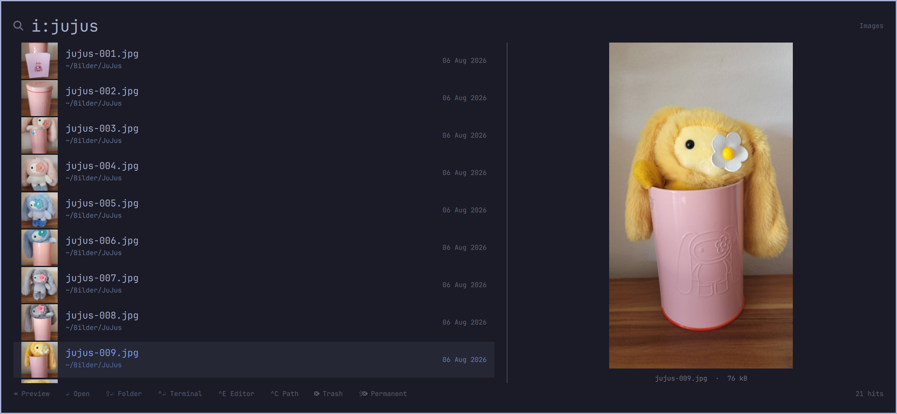

# File Search

A search overlay for the [Omarchy](https://omarchy.org) shell, backed by the
**localsearch** full-text index — the GNOME equivalent of KDE's Baloo. Bind a
key, press it, and type: files match by *content* as well as by name, with
thumbnails, dates and a preview pane.

Omarchy already ships localsearch as a Nautilus dependency and indexes your
home directory, but nothing exposes that index to the keyboard. This does.



## What it does

- **Full-text search**, not just filenames. A PDF whose name says nothing but
  whose text says "invoice" still shows up.
- **Prefixes** to narrow the search: `f:` filenames, `o:` folders,
  `d:` documents, `i:` images. Without one it searches content *and* names,
  filename matches first. `d:` and `i:` restrict the results to that file type
  and match both its filename and whatever the index extracted from it — an
  image's embedded title, a document's text.
- **Thumbnails** for images, glyphs for everything else, at full row height.
- **Modified date** per hit, `today HH:mm` / `yesterday HH:mm` for recent files.
- **Preview pane** on <kbd>Tab</kbd>: images enlarged, folders listed and
  navigable in place, everything else as name, path, type, size and date.
- **Actions** on the selection: open, reveal in the file manager, terminal in
  the folder, open in your editor, copy the path, move to trash or delete.
- A bar widget — a magnifying glass () in the bar. The one way in that
  works the moment you install it, before you have bound anything.

## Requirements

The index itself does the work, so it has to be running:

```bash
localsearch status          # should report indexed files, not an error
```

On Omarchy this is already the case. If `localsearch status` reports nothing
indexed, the index is still building — searches stay empty until it finishes.

By default localsearch indexes all of `$HOME`. To change what it covers:

```bash
gsettings get org.freedesktop.Tracker3.Miner.Files index-recursive-directories
gsettings set org.freedesktop.Tracker3.Miner.Files ignored-directories "['.git','node_modules','.cache']"
```

### Dependencies

| Package | Used for |
|---|---|
| `localsearch`, `tinysparql` | the index and the `localsearch search` query |
| `glib2` | `gio trash` for the trash action, `gdbus` for revealing files |
| `wl-clipboard` | `wl-copy` for copying a path |
| `xdg-utils` | `xdg-open` to open files |
| `xdg-terminal-exec` | terminal in the folder |
| `uwsm` | launching apps into the session's systemd scope |
| `coreutils`, `findutils` | `stat`, `find`, `sort` in the helper scripts |

Also uses Omarchy's own `omarchy-launch-editor` and
`omarchy-notification-send`. All of the above ship with Omarchy.

Revealing a file uses the `org.freedesktop.FileManager1` D-Bus interface, so
it works with Nautilus, Dolphin, Thunar, Nemo or PCManFM and preselects the
file. Where no file manager provides that interface it falls back to opening
the containing directory with `xdg-open`.

## Install

**1. Add the plugin.**

```bash
omarchy plugin add https://github.com/corck/omarchy-filesearch --enable
omarchy restart shell
```

That installs the overlay and puts the bar widget in the left section. Move it
with `omarchy bar move io.github.corck.filesearch --section right`.

**2. Bind a key.**

Installing the plugin does *not* give you a keyboard shortcut, and it cannot:
Omarchy's plugin system never writes to your Hyprland config. Until you do one
of this step or the next, the only way to open the overlay is clicking the bar
widget. Add a binding to `~/.config/hypr/bindings.lua`:

```lua
o.bind("F3", "File search", "omarchy-shell shell toggle io.github.corck.filesearch '{}'")
```

Pick whatever key you like — <kbd>F3</kbd> and <kbd>Super</kbd>+<kbd>Ctrl</kbd>+<kbd>F</kbd>
are both unused by stock Omarchy, so either is a safe default:

```lua
o.bind("SUPER + CTRL + F", "File search", "omarchy-shell shell toggle io.github.corck.filesearch '{}'")
```

Binding both is fine — they are ordinary Hyprland bindings running the same
command, and the command toggles, so the same key closes the overlay again.

**3. Optional: add it to the Omarchy menu.**

If you would rather reach it from <kbd>Super</kbd>+<kbd>Space</kbd> than from a
dedicated key, add a row to `~/.config/omarchy/extensions/omarchy-menu.jsonc`:

```jsonc
"find": {"icon":"","label":"Find","aliases":["search"],"description":"Search file contents and names via the localsearch index","action":"omarchy-shell shell toggle io.github.corck.filesearch '{}'"},
```

The menu watches that file, so the row appears as soon as you save — no
restart. It is then also reachable as `omarchy menu summon find`.

**4. Reload Hyprland.**

Only needed for the keybinding in step 2:

```bash
hyprctl reload
```

## Remove

```bash
omarchy plugin remove io.github.corck.filesearch
omarchy restart shell
```

That drops the bar widget from `~/.config/omarchy/shell.json` and deletes the
plugin folder. Because the folder is a git working copy, it is removed
outright rather than backed up — Omarchy assumes the repository is still
upstream, so back up any local edits first.

Two things it cannot clean up, because they are yours: the keybinding in
`~/.config/hypr/bindings.lua` — delete the `o.bind` line and run
`hyprctl reload` — and, if you added it, the `"find"` row in
`~/.config/omarchy/extensions/omarchy-menu.jsonc`.

Nothing else is left behind. The plugin writes no state, no cache and no
config of its own.

To disable it without uninstalling:

```bash
omarchy plugin disable io.github.corck.filesearch
```

## Keys

These are the keys *inside* the overlay. The key that opens it is whichever one
you bound yourself — see [Install](#install).

| | |
|---|---|
| <kbd>Tab</kbd> | preview pane — enters a folder, previews anything else |
| <kbd>↑</kbd> <kbd>↓</kbd> <kbd>PgUp</kbd> <kbd>PgDn</kbd> <kbd>Home</kbd> <kbd>End</kbd> | move the selection |
| <kbd>Enter</kbd> | open |
| <kbd>Shift</kbd>+<kbd>Enter</kbd> | reveal in the file manager, file selected |
| <kbd>Ctrl</kbd>+<kbd>Enter</kbd> | terminal in the folder |
| <kbd>Ctrl</kbd>+<kbd>E</kbd> | open in the default editor |
| <kbd>Ctrl</kbd>+<kbd>C</kbd> | copy the full path |
| <kbd>Delete</kbd> | move to trash |
| <kbd>Shift</kbd>+<kbd>Delete</kbd> | delete permanently, with a confirmation |
| <kbd>Backspace</kbd> / <kbd>Ctrl</kbd>+<kbd>U</kbd> | edit / clear the query |
| <kbd>Esc</kbd> | leave the folder, close the pane, clear the query, close — in that order |

In the folder pane, <kbd>→</kbd> descends, <kbd>←</kbd> goes up, and
<kbd>Tab</kbd> returns to the results. Typing anything goes back to searching.
Every action applies to the selection in whichever pane has the keyboard.

The mouse works too: hover selects, left click opens, right click reveals.

## How it works

The overlay is a Quickshell `overlay` plugin. Queries go to a small shell
script that runs `localsearch search`, merges filename and content hits,
de-duplicates them, drops index entries whose files are gone, and stats the
survivors in one pass. Typing is debounced by 160 ms, and a query arriving
mid-flight replaces the pending one instead of racing a second process.

Nothing is passed through a shell as text: every path reaches its command as a
literal argv element, so a filename containing a quote, a space or a `$` is
just a filename.

| File | |
|---|---|
| `FileSearch.qml` | the overlay: search, preview pane, actions |
| `BarWidget.qml` | the bar icon |
| `search.sh` | queries localsearch, emits one TSV row per hit |
| `list.sh` | lists a directory in the same row format |
| `reveal.sh` | reveals a file via `org.freedesktop.FileManager1` |

## Limitations

- Only text extracted by localsearch is searchable. A scanned PDF without OCR
  has no text to find.
- Results are ordered by the index's relevance, not by date.
- Filenames containing a newline are skipped by the helper scripts.
- Thumbnails are skipped above 25 MB, where decoding costs more than a
  row-height preview is worth. The large preview honours the same limit.

## License

MIT — see [LICENSE](LICENSE).
