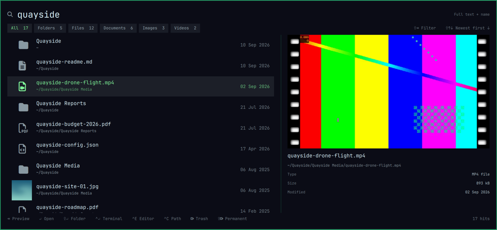
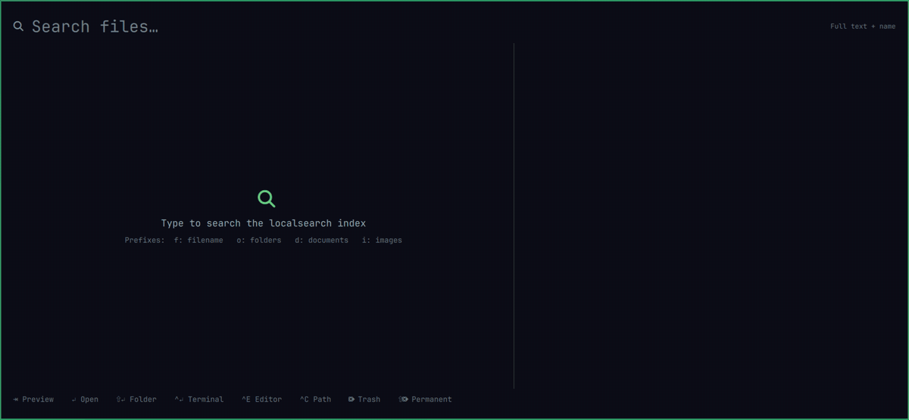

# File Search

A search overlay for the [Omarchy](https://omarchy.org) shell, backed by the
**localsearch** full-text index — the GNOME equivalent of KDE's Baloo. Bind a
key, press it, and type: files match by *content* as well as by name, with
thumbnails, dates and a preview pane.

Omarchy already ships localsearch as a Nautilus dependency and indexes your
home directory, but nothing exposes that index to the keyboard. This does.



## What it does

- **Full-text search**, not just filenames. A PDF whose name says nothing but
  whose text says "invoice" still shows up.
- **Prefixes** to narrow the search: `f:` filenames, `o:` folders,
  `d:` documents, `i:` images. Without one it searches content *and* names,
  filename matches first. `d:` and `i:` restrict the results to that file type
  and match both its filename and whatever the index extracted from it — an
  image's embedded title, a document's text.
- **Newest first**, folders included. <kbd>Shift</kbd>+<kbd>↑</kbd> turns the
  list around to oldest first, <kbd>Shift</kbd>+<kbd>↓</kbd> back again.
- **Type filter** under the query: `All`, `Folders`, `Files`, `Documents`,
  `Images`, `Videos`, each with the number of hits it holds.
  <kbd>Shift</kbd>+<kbd>Tab</kbd> steps through the ones that have anything in
  them, or click one. It narrows what is already on screen — no second search.
- **Thumbnails** for images, glyphs for everything else, at full row height.
- **Modified date** per hit, `today HH:mm` / `yesterday HH:mm` for recent files.
- **Preview pane** on <kbd>Tab</kbd>: images enlarged, folders listed and
  navigable in place, everything else as name, path, type, size and date.
- **Thumbnails in the preview** for PDFs, videos, office documents and
  anything else the desktop can render one for — the same picture a file
  manager shows, because it comes out of the same cache.
- **Actions** on the selection: open, reveal in the file manager, terminal in
  the folder, open in your editor, copy the path, move to trash or delete.
- A bar widget — a magnifying glass () in the bar. The one way in that
  works the moment you install it, before you have bound anything.

Typing, the two sort directions, the type filter and a thumbnail per
selection:



## Requirements

The index itself does the work, so it has to be running:

```bash
localsearch status          # should report indexed files, not an error
```

On Omarchy this is already the case. If `localsearch status` reports nothing
indexed, the index is still building — searches stay empty until it finishes.

By default localsearch indexes all of `$HOME`. To change what it covers:

```bash
gsettings get org.freedesktop.Tracker3.Miner.Files index-recursive-directories
gsettings set org.freedesktop.Tracker3.Miner.Files ignored-directories "['.git','node_modules','.cache']"
```

### Dependencies

| Package | Used for |
|---|---|
| `localsearch`, `tinysparql` | the index and the `localsearch search` query |
| `glib2` | `gio trash` for the trash action, `gdbus` for revealing files |
| `wl-clipboard` | `wl-copy` for copying a path |
| `xdg-utils` | `xdg-open` to open files |
| `xdg-terminal-exec` | terminal in the folder |
| `uwsm` | launching apps into the session's systemd scope |
| `coreutils`, `findutils` | `stat`, `find`, `sort`, `md5sum` in the helper scripts |

Thumbnails in the preview pane come from whatever thumbnailers are installed —
`evince` for PDFs, `ffmpegthumbnailer` for video and audio, `gnome-epub-thumbnailer`,
`libgsf` for office documents, and so on. None of them are required; a file
type with no thumbnailer keeps its glyph.

Also uses Omarchy's own `omarchy-launch-editor` and
`omarchy-notification-send`. All of the above ship with Omarchy.

Revealing a file uses the `org.freedesktop.FileManager1` D-Bus interface, so
it works with Nautilus, Dolphin, Thunar, Nemo or PCManFM and preselects the
file. Where no file manager provides that interface it falls back to opening
the containing directory with `xdg-open`.

## Install

**1. Add the plugin.**

```bash
omarchy plugin add https://github.com/corck/omarchy-filesearch --enable
omarchy restart shell
```

That installs the overlay and puts the bar widget in the left section. Move it
with `omarchy bar move io.github.corck.filesearch --section right`.

**2. Bind a key.**

Installing the plugin does *not* give you a keyboard shortcut, and it cannot:
Omarchy's plugin system never writes to your Hyprland config. Until you do one
of this step or the next, the only way to open the overlay is clicking the bar
widget. Add a binding to `~/.config/hypr/bindings.lua`:

```lua
o.bind("SUPER + F3", "File search", "omarchy-shell shell toggle io.github.corck.filesearch '{}'")
```

Pick whatever key you like — <kbd>Super</kbd>+<kbd>F3</kbd> and
<kbd>Super</kbd>+<kbd>Ctrl</kbd>+<kbd>F</kbd> are both unused by stock Omarchy,
so either is a safe default:

```lua
o.bind("SUPER + CTRL + F", "File search", "omarchy-shell shell toggle io.github.corck.filesearch '{}'")
```

Keep a modifier in it, though. A Hyprland binding is a global grab, so a bare
<kbd>F3</kbd> is taken away from every window on the system — including the
browser and the editor where it means find-again.

Binding both is fine — they are ordinary Hyprland bindings running the same
command, and the command toggles, so the same key closes the overlay again.

**3. Optional: add it to the Omarchy menu.**

If you would rather reach it from <kbd>Super</kbd>+<kbd>Space</kbd> than from a
dedicated key, add a row to `~/.config/omarchy/extensions/omarchy-menu.jsonc`:

```jsonc
"find": {"icon":"","label":"Find","aliases":["search"],"description":"Search file contents and names via the localsearch index","action":"omarchy-shell shell toggle io.github.corck.filesearch '{}'"},
```

The menu watches that file, so the row appears as soon as you save — no
restart. It is then also reachable as `omarchy menu summon find`.

**4. Reload Hyprland.**

Only needed for the keybinding in step 2:

```bash
hyprctl reload
```

## Remove

```bash
omarchy plugin remove io.github.corck.filesearch
omarchy restart shell
```

That drops the bar widget from `~/.config/omarchy/shell.json` and deletes the
plugin folder. Because the folder is a git working copy, it is removed
outright rather than backed up — Omarchy assumes the repository is still
upstream, so back up any local edits first.

Two things it cannot clean up, because they are yours: the keybinding in
`~/.config/hypr/bindings.lua` — delete the `o.bind` line and run
`hyprctl reload` — and, if you added it, the `"find"` row in
`~/.config/omarchy/extensions/omarchy-menu.jsonc`.

The one thing it does leave is a cache: thumbnails it had to generate itself,
under `~/.cache/omarchy-filesearch`. Nothing reads it but this plugin and
nothing in it cannot be made again, so it is safe to drop:

```bash
rm -r "${XDG_CACHE_HOME:-$HOME/.cache}/omarchy-filesearch"
```

Beyond that the plugin writes no state and no config of its own.

To disable it without uninstalling:

```bash
omarchy plugin disable io.github.corck.filesearch
```

## Keys

These are the keys *inside* the overlay. The key that opens it is whichever one
you bound yourself — see [Install](#install).

| | |
|---|---|
| <kbd>Tab</kbd> | preview pane — enters a folder, previews anything else |
| <kbd>Shift</kbd>+<kbd>Tab</kbd> | next type filter — All, Folders, Files, Documents, Images |
| <kbd>↑</kbd> <kbd>↓</kbd> <kbd>PgUp</kbd> <kbd>PgDn</kbd> <kbd>Home</kbd> <kbd>End</kbd> | move the selection |
| <kbd>Shift</kbd>+<kbd>↑</kbd> / <kbd>Shift</kbd>+<kbd>↓</kbd> | sort oldest first / newest first |
| <kbd>Enter</kbd> | open |
| <kbd>Shift</kbd>+<kbd>Enter</kbd> | reveal in the file manager, file selected |
| <kbd>Ctrl</kbd>+<kbd>Enter</kbd> | terminal in the folder |
| <kbd>Ctrl</kbd>+<kbd>E</kbd> | open in the default editor |
| <kbd>Ctrl</kbd>+<kbd>C</kbd> | copy the full path |
| <kbd>Delete</kbd> | move to trash |
| <kbd>Shift</kbd>+<kbd>Delete</kbd> | delete permanently, with a confirmation |
| <kbd>Backspace</kbd> / <kbd>Ctrl</kbd>+<kbd>U</kbd> | edit / clear the query |
| <kbd>Esc</kbd> | leave the folder, close the pane, clear the query, close — in that order |

In the folder pane, <kbd>→</kbd> descends, <kbd>←</kbd> goes up, and
<kbd>Tab</kbd> returns to the results — as does <kbd>Shift</kbd>+<kbd>Tab</kbd>,
since the filter belongs to the search, not to a directory listing. Typing anything goes back to searching.
Every action applies to the selection in whichever pane has the keyboard.

The mouse works too: hover selects, left click opens, right click reveals.

## How it works

The overlay is a Quickshell `overlay` plugin. Queries go to a small shell
script that runs `localsearch search`, merges filename and content hits,
de-duplicates them, drops index entries whose files are gone, and stats the
survivors in one pass. Typing is debounced by 160 ms, and a query arriving
mid-flight replaces the pending one instead of racing a second process.

Nothing is passed through a shell as text: every path reaches its command as a
literal argv element, so a filename containing a quote, a space or a `$` is
just a filename.

Argv is public, though. `/proc/<pid>/cmdline` is world-readable unless `/proc`
is mounted with `hidepid`, so anything in a command line can be read by any
other local user for as long as that process lives. For most of the commands
here that is a moment — `xdg-open`, `gio trash` and the rest are gone in
milliseconds. `wl-copy` is the exception: it stays alive for as long as it owns
the clipboard, so a path in its argv would sit there readable for minutes. It
gets the path over stdin instead, which nothing else can read. Opening a file
in an editor or a viewer still puts its path into that program's argv, exactly
as it would from a file manager — that much is inherent to launching a program
with a file.

The rows themselves are tab-separated and newline-delimited, which makes a tab
or a newline inside a filename a question of correctness rather than taste.
Such a name lands in the middle of a row and shifts every column after it, so
the column the overlay reads as the path would hold the parent directory; and
a newline can do worse than shift, because it can end one record and begin
another that nothing ever wrote. A file named `evil<newline>victim` sitting
next to a real `victim` is a forged row pointing at the real one, and it is
well-formed by every measure applied after the split.

So the framing comes first: `list.sh` reads `find` output in NUL-delimited
records, NUL being the one byte a filename cannot contain, and `search.sh`
reads percent-encoded URIs, where a newline arrives as `%0A`. Neither can be
made to see a record its producer did not write. On top of that, neither
script emits a row whose path holds a tab or a newline, the overlay accepts a
row only if it splits into exactly six fields rather than six or more, and the
delete queue refuses any path that is not absolute.

| File | |
|---|---|
| `FileSearch.qml` | the overlay: search, preview pane, actions |
| `BarWidget.qml` | the bar icon |
| `search.sh` | queries localsearch, emits one TSV row per hit |
| `list.sh` | lists a directory in the same row format |
| `thumb.sh` | finds or generates the preview pane's thumbnail |
| `reveal.sh` | reveals a file via `org.freedesktop.FileManager1` |

Thumbnails follow the freedesktop spec, which is why the picture for a PDF you
have already opened in a file manager appears instantly: it is that file
manager's, read straight out of `~/.cache/thumbnails` under the md5 of the
file's URI. Anything not in there yet is handed to the system thumbnailer
registered for its type — the same program the file manager would call. Those
go in `~/.cache/omarchy-filesearch` rather than the shared cache, because a
thumbnailer's raw output lacks the `Thumb::URI` and `Thumb::MTime` metadata the
spec asks for, and other readers are right to discard entries without it.

Only the one row the preview pane is showing is ever thumbnailed, after a
220 ms pause, one at a time. Arrowing down a folder of videos does not start a
thumbnailer per keystroke.

## Limitations

- Only text extracted by localsearch is searchable. A scanned PDF without OCR
  has no text to find.
- Sorting is by modification time, which is what the filesystem reports for
  every file and folder. Creation time is not: most tools never set it and on
  many filesystems it reads back empty.
- Sorting and filtering work on the hits the query returned, and a query
  returns at most 40 — the index picks those by relevance. So "oldest first" is
  the oldest of the best 40 matches, not the oldest match on the disk.
- Some thumbnailers only unpack a preview image the file already carries
  rather than rendering it. An `.odt` or `.docx` saved without one therefore
  has no thumbnail, in this overlay and in your file manager alike.
- Filenames containing a tab or a newline are skipped by the helper scripts.
  Both are legal on Linux and both are separators in the row format, so such a
  file cannot be described unambiguously and is left out rather than described
  wrongly.
- Thumbnails are skipped above 25 MB, where decoding costs more than a
  row-height preview is worth. The large preview honours the same limit.

## License

MIT — see [LICENSE](LICENSE).
